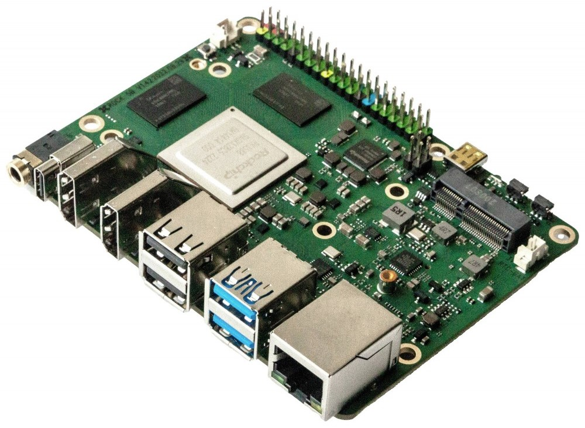

# DISCLAIMER
The project is only for educational purposes and definitely NOT FOR PRODUCTION. Some of the steps are completely against of standard security principles (running container in privilege). There is no warranty and no SLA. Nobody takes responsibility to this concept. You get it as it is and you can use it on your own.

The project is not supported, endorsed or encouraged by Microsoft. This is an independent personal (likely opinionated) project to demonstrate possible capabilities.

# Introduction
This project helps to deploy the Arc extensions on ARM64 boards. In some cases, it reaches the goal by QEMU emulator (running x86-64 binaries on ARM64) and in some cases it rebuilds some images.

More detailed description can be found here: https://clidee.eu/2024/05/27/azureml-extension-on-arm64/

# The ARM board
The concept is tested on a [Radxa Rock5B](https://radxa.com/products/rock5/5b/) (aka. OKDO Rock5B) board because of the following reasons:
- CPU: Rockchip RK3588 CPU with 8 cores (4x Cortex-A76 and 4x Cortex-A55)
- Memory: 16GB (more than enough to host several apps)
- eMMC and M2 options for fast storage (Arc is sensitive to has storage). You will need at least 64GB of storage but more is always better. MicroSD card might be too slow for this use-case.
- and most importantly an 6 TOPS NPU (Neural Processing Unit) --> an AI accelerator.

You can read a detailed review about the board on [CNX Software's blog](https://www.cnx-software.com/2022/01/09/rock5-model-b-rk3588-single-board-computer/). Nevertheless there are other boards from different vendors with this SoC with similar capabilities.

[](./img/Rock5B.jpg)

What about Raspberry PI (or other ARM)??? Well, I didn't tested it but I guess it shall work on an RPi-5 with 8GB memory as well. I will test it later if I have some spare time. For the AzureML, I strongly suggest to use an AI accelerator what the RPi is short of.

# Basic setup

## Node deployment
- Install an Ubuntu on the board. I used [Joshua's solution](https://github.com/Joshua-Riek/ubuntu-rockchip).
- Setup a fix IP address (run it on ARM board):
  ```bash
  if [ -z ${MasterIP+x} ]; then MasterIP="192.168.0.190"; fi
  
  sudo tee /etc/netplan/10-basic-config.yaml<<EOF
  network:
    ethernets:
      enP4p65s0:
        dhcp4: false
        dhcp6: false
        addresses:
          - ${MasterIP}/24
        routes:
          - to: default
            via: 192.168.0.1
        nameservers:
          addresses:
            - 192.168.0.1
    version: 2
  EOF
  
  sudo netplan apply
  ```
- Setup Kubernetes cluster (run it on ARM board):
  ```bash
  sudo apt update
  sudo apt install -y curl
  curl -sL https://raw.githubusercontent.com/szasza576/arc-on-arm/master/base-infra/kubernetes-setup.sh | sudo bash
  ```
- Copy the kubeconfig file to your management computer

## Azure setup and Arc connectivity
Attaching the node with Arc is easy as ARM is supported by Arc so this is just following the [documentation](https://learn.microsoft.com/en-us/azure/azure-arc/kubernetes/system-requirements).

Before starting check if your cluster is the active context and switch if necessary:
```powershell
kubectl config get-contexts

kubectl config use-context <YourClusterName>
```

```powershell
$ResourceGroup="arc-on-arm"
$ClusterName="rock5b"
$Location="westeurope"

az group create --name $ResourceGroup --location $Location

az connectedk8s connect `
  --name $ClusterName `
  --resource-group $ResourceGroup
```

## QEMU emulator
Deploy the QEMU emulator. Credits go to [@tonistiigi](https://github.com/tonistiigi) for his great [binfmt](https://github.com/tonistiigi/binfmt) work.
```bash
kubectl apply -f https://raw.githubusercontent.com/szasza576/arc-on-arm/main/base-infra/multiarch.yaml
```

Normally this shall run only once after restart but I experienced that sometimes it de-register hence a cronjob will re-register the module in every 5 minutes.

## Local Docker registry
We will rebuild some images and hence we need a local Docker registry. Note that, we will use the "localhost" name so this will work with only single node clusters. If you are setting up a multi-node cluster then you need to run the Registry service in a proper way.

Run these commands on the ARM board:
```bash
sudo mkdir /mnt/registry
sudo chown $(id -u):$(id -g) /mnt/registry
docker run -d -p 5000:5000 -v /mnt/registry:/var/lib/registry --restart unless-stopped --name myregistry registry:2
```

# AzureML extension

## Rebuild relayserver
The relayserver component uses a C# code and hence that container shall be rebuilt with ARM64 specific .NET framework.

Build ARM64 container for relayserver and push to the local repository (run it on the ARM board):
```bash
docker build -t localhost:5000/azureml/amlarc/docker/relayserver:1.1.53 https://github.com/szasza576/arc-on-arm.git#main:azureml/relayserver
docker push localhost:5000/azureml/amlarc/docker/relayserver:1.1.53
```

## Extension patchers
There is a set of patcher scripts which helps you to easily change the images to ARM64 images. This runs in the background and do the patching when needed.

Deploy the patcher tools:
```powershell
kubectl apply -f https://raw.githubusercontent.com/szasza576/arc-on-arm/main/azureml/aml-patcher/aml-patcher.yaml
```

## Deploy Azure ML extension
Now you can deploy the Azure ML extension as written in the documentation.

You can use the portal and add the extension (deploy only the Prometheus and the Volcano components) or you can use the following Azure CLI command:
```powershell
$ResourceGroup="arc-on-arm"
$Location="westeurope"
$ClusterName="rock5b"
$AMLExtName="azureml"

az k8s-extension create `
  --name $AMLExtName `
  --cluster-name $ClusterName `
  --resource-group $ResourceGroup `
  --extension-type Microsoft.AzureML.Kubernetes `
  --config enableTraining=True `
           enableInference=True `
           inferenceRouterServiceType=LoadBalancer `
           allowInsecureConnections=True `
           inferenceLoadBalancerHA=False `
  --cluster-type connectedClusters  `
  --scope cluster
```

# Uninstall
You can uninstall the extension in the normal way via the Portal.

To uninstall the patcher components just delete the namespaces and restart the node (to remove QEMU):
```bash
kubectl delete ns qemu
kubectl delete ns aml-patcher
sudo reboot
```

# Troubleshoot
## I get ImgPullError
This repo is not continuously updated and if Azure updates the versions then it will fall out of sync. Please update the version numbers in the relevant files or open an issue here so I'm notified.
## Model inference timeout
You can deploy AI models with the default Azure ML environment but those are based on x86-64 codes and hence those will run within a QEMU emulated environment. It means it will be extremely slow.

You need to create an ARM64 environment image in AzureML and upload it to the AzureML's registry. It is important to build the whole image what AzureML can import. If you also specify a conda file then AzureML tries to build the image and of course it cannot deal with ARM64 images so it will fail. I will create a guide about this.

Just as a reference: running a Yolov5 on a weak notebook with (Nvidia 940m](https://www.techpowerup.com/gpu-specs/geforce-940m.c2643) takes 150 ms to score an image. The same model can be deployed here but will run on CPU due to lacking Nvidia card* and also it runs inside QEMU and it takes 100 seconds (yes sec, not ms) to score.

*As the Rock5B has an PCIe 3.0 x4 M.2. connector hence it is possible to attach an Nvidia card to it ... but we will use its internal AI accelerator in the next round.

## Dead Kubernetes after restart
Despite of disabling the swap service, it comes back sometimes. Kubelet doesn't start if the swap is active.

Run these to disable the swap again:
```bash
sudo systemctl disable swapfile.swap
sudo systemctl stop swapfile.swap
```

Once it is done then Kubelet comes back to service and Kubernetes will be available in 1-2 minutes.